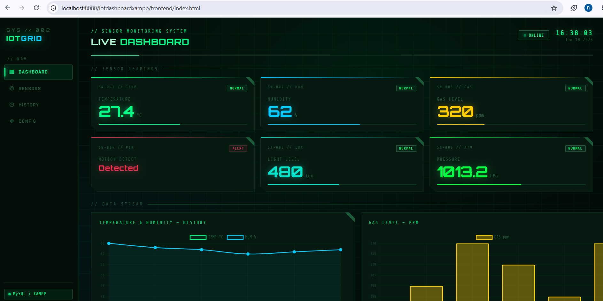
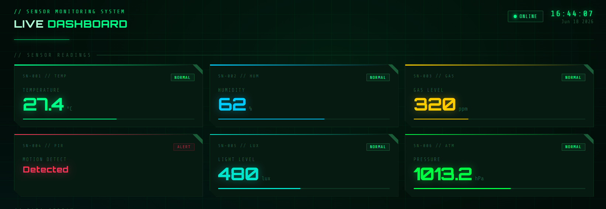
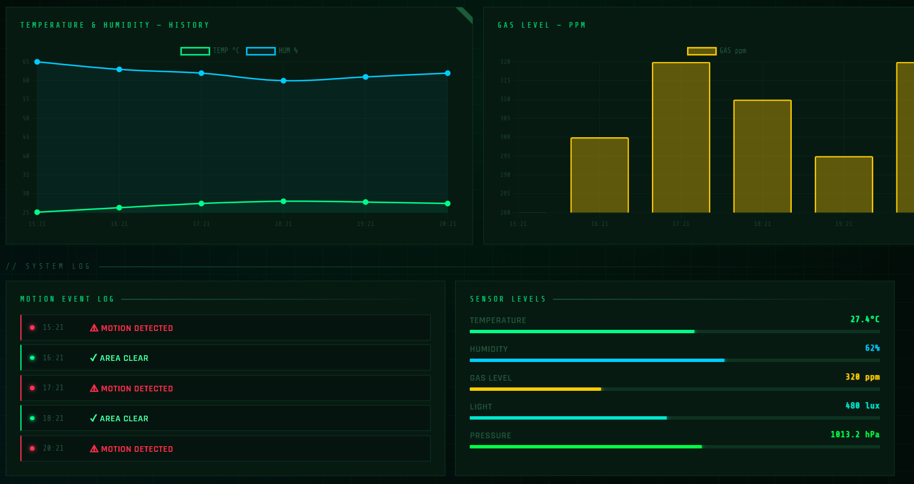

# 🌡️ IoT Dashboard - Sensor Monitoring System

## 📖 Description
This project is an IoT Dashboard built using PHP, MySQL, HTML, CSS, and JavaScript.  
It displays real-time sensor data such as temperature, humidity, and soil moisture, stored in a database and visualized in a simple web interface.

The project runs locally using XAMPP.

---

## ⚙️ Technologies Used
- PHP
- MySQL
- HTML5
- CSS3
- JavaScript
- XAMPP (Apache Server)

---

## 📊 Features
- Real-time sensor data display
- Temperature monitoring 🌡️
- Humidity monitoring 💧
- Soil moisture tracking 🌱
- Data stored in MySQL database
- Simple dashboard interface

---

## 🚀 How to Run the Project

### 1. Install XAMPP
Download from:
https://www.apachefriends.org/

### 2. Start Server
Open XAMPP Control Panel and start:
- Apache ✔️
- MySQL ✔️ (if database is used)

### 3. Move Project Folder
Place the project inside:

C:\xampp\htdocs\iotdashboardxampp

### 4. Open Browser
Go to:

http://localhost/iotdashboardxampp/

---

## 🗄️ Database Setup (if used)
1. Open phpMyAdmin:

http://localhost/phpmyadmin

2. Create a database  
3. Import the `.sql` file included in the project

---

## 📸 Screenshots:

### 🏠 Home / Dashboard

### 📊 Sensor Data

### 📈 History area

---

## 🎯 Future Improvements
- Cloud deployment ☁️
- Mobile app integration 📱
- Real-time graphs 📊
- IoT hardware integration (ESP32 / Raspberry Pi)

---

## 👩‍💻 Author
- Rania Daghsni
- Embedded Systems Engineering Student

---

## ⚠️ Note
This project runs locally using XAMPP and is intended for learning and demonstration purposes.

---

## 🌐 Project Link
http://localhost/iotdashboardxampp/
